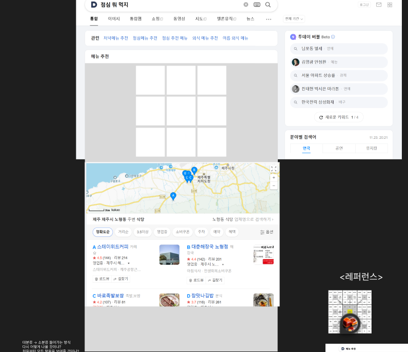
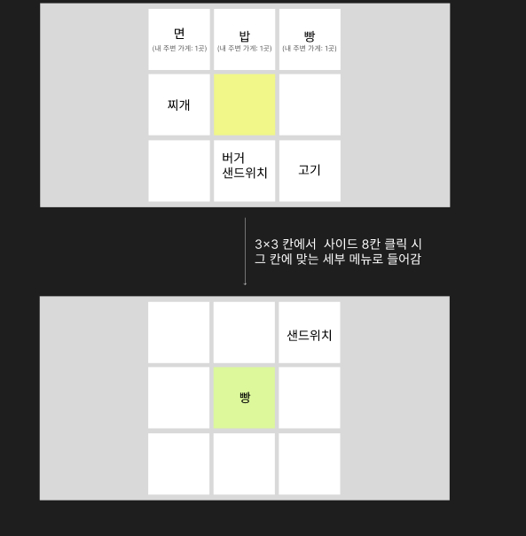
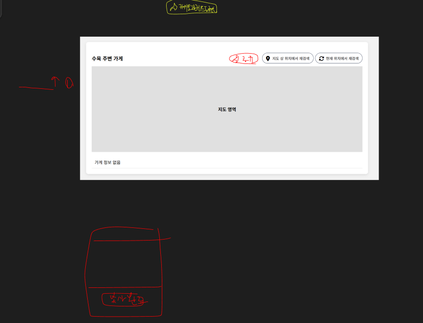

# 기획
## 기획안
<개요>
저희는 '만다라트 차트 기반 메뉴 추천 및 상호작용을 통한 지역 내 해당 메뉴를 가진 식당 목록화'라는 주제로 프로젝트를 진행할 예정입니다.
 

<배경>
기획자가 웹 서핑을 하다 우연히 만다라트 차트에 메뉴판을 적용한 이미지를 보았는데 아이디어가 좋았으나 실제로 이걸로 메뉴를 정한다고 생각해보니 메뉴 이미지를 보고 메뉴를 결정한 후에 일일이 지도 앱을 켜서 그 메뉴를 판매하고 있는 식당을 찾아 검색해야 하는 과정이 굉장히 번거로웠습니다. 전산화하면 좋을텐데라고 생각했습니다. 
> - (이미지의 단점) 저런 식으로 고정된 메뉴를 제시하는 경우 각 사용자의 지역에 그 분야 음식을 판매하고 있지 않는 경우가 있으면 오히려 허탕을 칠 수도 있습니다. 
>   저희의 도구는 이미지가 아닌 전산화된 시스템이기 때문에 현재 지역 내에 있는 식당들을 선택지로서 수집하고, 만다라트 차트를 구성해 전체 선택지를 시각화한다면 조금 더 개인에게 잘 맞는 더 적합한 결과를 제공할 수 있다는 점이 이미지 방식의 만다라트 메뉴판의 한계점을 뛰어넘을 수 있다고 보았습니다.
> - (일상적인 주제를 일상적인 검색으로 만나기) 저희는 처음부터 다음 검색 결과 컴포넌트로 들어갈 만한 주제로 만들어보자고 생각했기에 이 주제를 떠올렸을 때 너무 적합하다고 느꼈습니다. 사람들이 일상적으로 많이 고민하는 '오늘 점심 뭐먹지' 문제를 검색창으로 검색을 해서 접근하기에 접근성이 좋다는 점, 자주 떠올릴 만한 주제라는 점에서 전반적으로 활용성이 높다고 판단했기 때문입니다. 
> - (경쟁 서비스) 경쟁 서비스를 조사를 해보았으나 대부분 랜덤으로 메뉴를 추천해주는(랜덤으로 하나 던지고 사용자는 새로고침을 일일이 하면서 뽑아야 하는 방식) 정도에 지나는 것을 보았고, 이 만다라트 메뉴판을 전산화하거나 지도에 있는 가게 정보와 연동하는 경우는 탐색 과정 내 찾아볼 수 없었습니다.
 

<사용자의 사용 흐름 설계>
- 사용자는 다음 검색을 통해 해당 컴포넌트를 볼 수 있게 됩니다.
> 검색 키워드는 메뉴 추천, 뭐 먹지 기반으로 점심 메뉴 추천, 점심 뭐 먹지 등을 포괄함.
- 사용자는 3x3 형태의 칸 UI 를 보게 되고, 처음 들어오는 경우 만다라트 차트의 중앙 부분에서 전체 메뉴 갈래가 선택지로 보이게 됩니다.
> 일식, 중식, 한식 등. 단 이 기준들은 추후 재정립해야 할 필요가 있음.
- 이후 사용자가 원하는 메뉴 갈래를 선택하면 화면의 3x3 이 그 갈래의 세부 메뉴로 배정되며 세부적인 선택지를 볼 수 있게 됩니다.
- 여기서 각 세부 메뉴를 클릭하면 사용자가 위치한 지역에 있는 식당/카페들 정보를 수집해 사용자에게 화면에 목록으로 보여줍니다. (3x3 UI 아래에 목록 결과로 출력됩니다.)
> - 조사한 백엔드 구현 방식/API 자료입니다. https://docs.google.com/document/d/1d7ONQULte9nVWK-yw7j4tcDlTYdR-0PR9VpiaRcAotU/edit?usp=sharing
 

사진 1: 다음 검색 결과 컴포넌트로 활용될 것을 기반으로 해 
사진 2: 만다라트 차트 모형 (사진 출처: https://blog.naver.com/boothebeige/220616450912)
 

## wbs (일정표)
일정표는 따로 없었고 강사님께서 처음에 말씀해주신 첫 주차에 주제 선정, 두 번째 주차에 기획서, 세 번째 주차에 FE, 네 번째 주차에 BE 를 진행하는 일정에 맞춰서 수행하기로 팀 내에 안내 및 합의하였다.
      
실제로 적용을 해보았으나 첫 주차 주제 선정 발표 시간까지 주제를 구체화하지 못하였고, 두 번째 주차에는 주제를 바꾸었고 이 주제로도 발표를 수행하지 못하였던 것으로 기억하고 있다. 이후 FE 주차로 넘어가기 전까지 문서화/구체화를 마무리하여 강사님께 넘겼다.
 
FE 로 넘어가고 나서는 다소 순조로웠다. LLM chatbot의 도움을 많이 받았고 대강 초안을 구성되면 그걸 수정했다. 만족하면 넘겼고 문제가 생기면 고쳤다.
BE 담당자는 미리 자기가 할 수 있는 대다수의 준비를 비동기적으로 진행하여 사용할 만한 API 문서 조사 및 문서화를 주도적으로 마쳤으며 BE 주차에 진입하기 전에 이미 우리는 FE에서 나온 초안을 BE 담당자와 합의하에 당일날 전부 BE api 호출 기능까지 받아와서 마무리했다. 
BE 주차에 진입해서는 우리가 강사님께 피드백 받았던 공유 기능 추가 부분을 구현하였다.
 

## 와이어프레임
### 초기에 구상한 메인 디자인 초안

기존에 있던 다음 검색 결과 창과 지도 검색 결과 페이지에서 가져온 사진을 이어붙여 이런 느낌으로 하자고 제안했다.
3x3 타일 정도는 피그마 기능으로 구성했다.
### 타일 구성
 
타일 안(2종류의 글자)이 어떻게 구성되어야 하는지, 바탕 색상과 타일 색상 등을 정의했다.
사이드칸을 클릭할 때 그 칸에 맞는 세부 메뉴로 들어간다는 점을 보여주었다.
### 추가 기능 구현: 공유 기능 추가 시점

우리가 만든 초안 스크린샷을 가져와 그 기반으로 위에 어떤 식으로 구성해야 할지 덧그리고 논의하며 진행했다.
 

# 디자인
## 피그마 링크
- 링크: https://www.figma.com/design/QjtL9ekZaLFLj1tcokRYHK/%EA%B8%B0%EC%B4%88%EC%9B%B9%EA%B0%9C%EB%B0%9C%EB%A1%A0-4%EC%A1%B0-%EC%A0%90%EC%8B%AC-%EB%AD%90-%EB%A8%B9%EC%A7%80?node-id=0-1&t=DJvvQA3h7kVqDzz6-1
 
피그마 사용법을 잘 몰랐다. 피그마에 피그잼이라고 화이트보드가 있는데 그 피그잼을 사용하진 않았으나 피그마 디자인 페이지를 마치 화이트보드처럼 사용했다. 
우리에게 시간은 부족했고, 기획/디자인 담당인 나에게는 FE에게 디자인을 넘겨줘야 하는 임무가 있었으며 나는 내 머릿속 디자인을 피그마로 표현하기에 실력이 부족했다. 그렇기에 나는 추상적인 아이디어를 최대한 감이라도 전달하자고 생각하였으며 그게 내가 내린 최선의 대응이었다. 그리하여 나는 기존 다음 결과창과 레퍼런스들을 찾아와 이어붙이며 최종 결과물의 모습을 팀원들에게 시각적으로 표현하였다.
 
FE에게 보내준 디자인 문서는 존재하지 않았으며 나는 문서 대신 직접 FE 곁에서 작업을 도왔다. "이곳에 3x3 타일이 들어가야 한다.", "박스를 두자", "얘를 좀 더 이쪽으로 옮기자"라고 지시했고, FE 담당은 감사하게도 이런 작업을 묵묵히 따라와주었다. 
 
우린 이후에 강사님께 피드백을 받고 추가 기능을 구현해야 할 때에도 피그마를 켜서 화이트보드처럼 사용했다.
일단 디자인 초안을 작성해서 시각적으로 만들어두기만 하면 FE 목업/테스팅 리포지토리로 달려가 초안을 실체화했다. 그 다음 실체화된 첫 상태를 보고 수정할 부분들을 찾고, 수정하길 반복했다. 우린 피그마를 본 시간보다 웹 브라우저의 개발자 도구 창을 더 많이 보며 작업했다.  
 

## 디자인 시스템
되게 좋은 개념인 것 같은데 프로젝트를 모두 수행하고 나서 공통 산출물 양식을 제공받을 때에서야 표현을 처음 들었다.
실제로 저희 팀에서는 적용을 한 게 없다. 다만 비슷한 개념을 우리는 다음 사이트의 컴포넌트를 모방하며 스타일을 모두 채용했기 때문에 다음의 디자인 시스템을 참조했다고 볼 수 있다.
 
다음 컴포넌트의 스타일을 채용한 부분들과 우리 팀 내에서 쓰자고 정의한 내용을 정의해보자면 다음과 같다.
 

### 다음 컴포넌트 스타일 채용하기
그나마 우리가 가장 FE스럽게 작업한 부분이라고 생각한다. 우린 비록 우리 소속이 아니지만 다음의 디자인 팀이 넘겨준 값을 그대로 구현한 다음 검색 결과 페이지의 목업을 따냈고 그 스타일 위에 우리의 컴포넌트를 삽입하였다.
 
채용한 것들
- border color 및 round 정도
- shadow color 및 정도
- margin/padding 사이즈
- background color
- 컴포넌트 깊이별 font 종류와 크기
 

### 우리가 제시하기
우리가 제시한 건 다음 Daum 아이콘의 색상을 채용해보자는 것밖에 없다.
다른 Naver 같은 플랫폼은 자기들 색상을 적극적으로 보여주는데 다음은 저 진한 남색을 활용하지 않는 것 같아 우리가 활용했다.
우린 선택지 컴포넌트의 border-color 를 Daum 상징의 진한 남색으로 채용하였다.
통일된 스타일 정보는 이미 결정론적으로 공개되어있었고, 우린 빠르게 작업했다.
 

## 피그마 프로토타입
피그마 프로토타입 기능의 존재는 알고 있었으나 사용법은 몰랐다. 우린 그런 것 없이 곧바로 FE로 넘어가 프로토타입을 직접 만들었다. LLM chatbot을 사용해 프로토타이핑을 하였기에 피그마 프로토타입이 없었어도 크게 불편함을 겪진 않았다.
 

## 라이선스 정리
아이콘 정보: font-awesome 라이센스 (https://fontawesome.com/license)