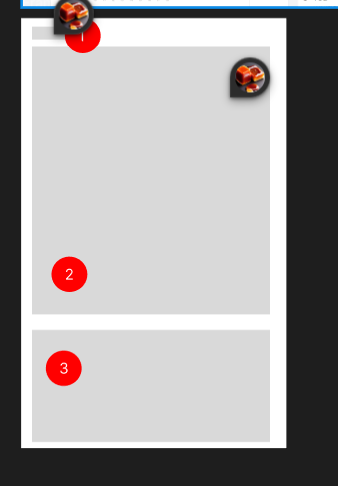
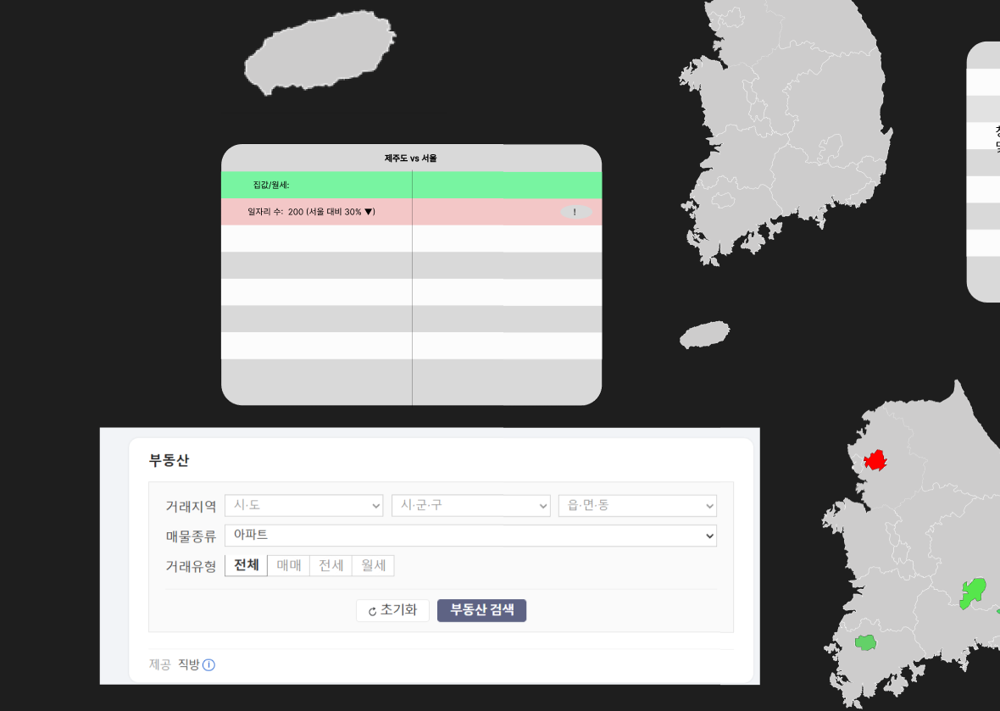
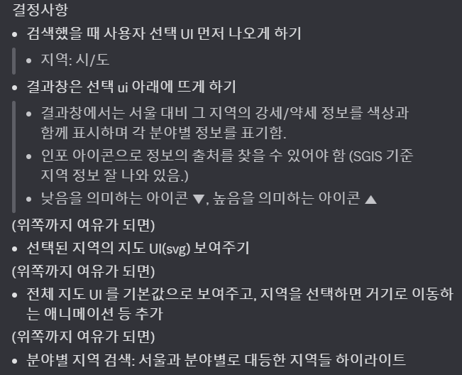
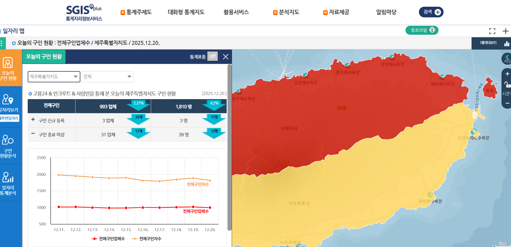
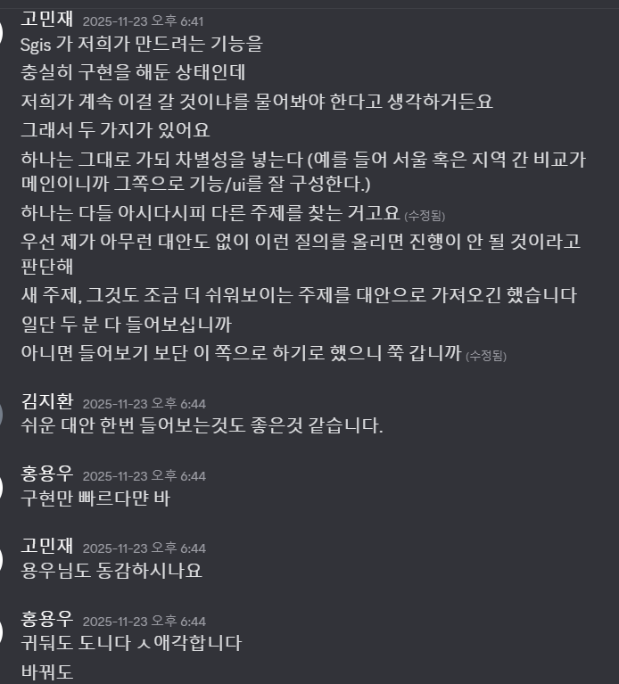
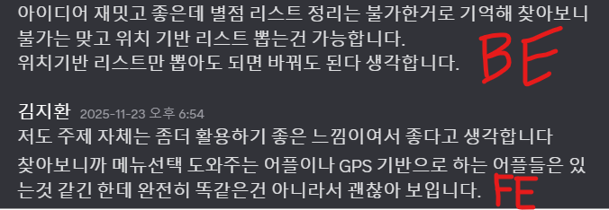

# 리스크 관리
- 작성자: 2023108094 컴퓨터공학과 고민재
- 담당: 기획/디자인

리스크를 프로젝트를 진행하며 미리 알 수 없는 비결정론적인 모든 정보들로 정의하며, 프로젝트를 진행하면서 팀원들과 협의하고 하나씩 확장지어갔던 것들(이하 Question), 중간에 발생한 진행 방향을 급변시키는 상황 및 결정(이하 Challenge), 지나고 회고해보니 다음 시도자들이 참조할 만한 '미리 준비하면 좋았을 만한 것들'(이하 Lesson)에 대한 정보를 다룹니다.

## Question 1. 소통은 어떻게 할 것인가?
팀원들에게 디스코드 하냐고 물었고 다들 디스코드를 하고 있어서 디스코드로 하자고 결정했다.

## Question 2. 언제 만날 것인가?
팀원들과 합의해서 주차별로 모두가 공통적으로 비는 시간 하나를 잡았다.
매주 목요일 오후 2시 1회 만나기로 합의했다.
회의 시간에는 일 배분하고 진도 점검만 하자고 합의했다.

## Question 3. 문서화는 어떻게 할 것인가?
디코 카테고리/채널/스레드 기능을 활용했다.
큰 범주의 내용들은 카테고리와 채널로 나누었다.
각 채널 내에서 장기적으로 참조할 세부 주제들은 나중에 다시 찾아보기 쉽도록 스레드 기능을 이용해 대화 기록을 나눴다. 

## Question 3. 작업 지시는 어떻게 할 것인가?
역할 분담에 관한 것이었다.
팀원들과 상의 후 서로 간섭 없이 각자에게 일단 하라고 믿고 맡기는 것으로 결정했다.
도움을 요청하면 도와주는 방식으로 하자고 진행했다.
각자 맡은 역할의 자율성과 책임감을 지켜주는 방식이었다고 생각한다.

실제로도 이와 비슷하게 진행이 되었다. 각자 먼저 다른 이들이 수행하는 과정 자체에 간섭하지 않았고 도움을 요청하거나 도움이 필요한지 묻고 먼저 다가갔다. 서로가 가져온 결과에 대한 피드백을 남겼고, 서로에게 그 다음 단계를 주문했다.

모든 팀원이 실력이 균등한 게 아니었다. 
BE 담당자는 이미 고숙련되었기에 자기가 뭘 해야 하는지 알고 자료를 주도적으로 찾고, 정해진 바를 빠르게 구현했다. 
기획/디자인 담당자인 필자는 기획과 디자인을 정석적으로 하는 방법은 몰랐지만 머릿 속에 뭘 만들어야 할지는 알고 있었기에 그것을 최대한 글로 전했다. 글로 전달하기 불확실한 디자인 배치같은 부분들은 디스코드 화면 공유와 말로 지시했다. 
FE 담당자는 개발에 능숙하지 않았으나 자신의 수준을 미리 밝히고 양해를 구한 뒤 자신이 할 수 있는 최대한을 하겠다고 선언하였고 실제로 의지를 가지고 최대한 수행하려 했고, 질문했고, 계속 배우려고 했고, 도움을 구했고, 결과적으로 chatgpt를 가지고 계속해서 결과물을 만들어왔다.  

실력이 균등하지 않았으나 각자가 다 나름대로 최선의 기여를 했다고 생각한다. 서로 이 프로젝트를 완수하는 목표와 작업을 수행하는 서로에 대한 존중과 배려를 하는 분위기였다고 느꼈다.
그렇게 서로가 자기 역할을 다 해 빠르게 목표까지 완주한 그런 모범적인 팀 프로젝트가 되었다고 생각한다.

## Challenge 1. 초기 플젝 주제 어떻게 갈 것인가?
프로젝트의 주제의 중요성은 두말 할 것 없이 대다수가 중요하다고 이야기할 것이다.
난 기획자로서 주제를 정해야 했다. 팀원 수준, 다음 검색 결과 컴포넌트에 들어갈 만한 내용, 전체 일정 등을 보고 최적의 주제를 찾아야 했다.

주제를 떠오르게 한 계기는 강사님. 강사님의 면담을 거쳐서 나온 주제이기 때문에 연결성이 좋은 주제였다. 
강사님과의 면담 이후 쭉 생각하던 한 가지 내용은 "서울을 가라"라는 말이었다. 
현재 편안한 장소에서 편안하게 있지 말고 사람들이 몰리는, 힘이 드는 장소에 가서 몸을 던져 살아 남아보라는 말이었다. 필자 또한 이런 내용을 자주 들어보고, 의미도 알고 있고, 오랫동안 실천 가능성에 대해 생각한 내용이어서 공감이 되었으나 누군가가 나에게 직접적으로 말을 던진 것은 별개의 문제였다. 

그때의 면담은 방아쇠였다. 강사님이 아주 흉악하게 그 정글에서 살아남은 생존자의 웃음을 지으며 나에게 나지막히 그런 조언을 하였다. 나에게 던진 단 하나의 조언은 듣기에 매우 간단하지만 수행하기에 너무나도 무거웠다. 어린 시절, 그런 조언들을 들으며 마음 속에 "언젠가 고려해야 할 문제"로 차곡차곡 뒷전에 쌓아오며 "아직은 내가 할 게 아니다."로 미래의 나에게 고민을 넘겼으나, 이제 시간이 흘러버려 당당히 청년에 위치해버린 이 시점의 나에게 그 조언은 지금 풀어야 할 현실의 문제가 되었다.

이제는 생각을 해야할 시점이 되어버렸다. 그래. 그렇다면 강사님의 말대로 가보자고, 서울로 가보자고 가정하자. 하지만 중요한 문제가 있다. 필자는 그 서울에 대해서 모르는 게 너무 많아서 미리 찾아보고 가야 했다. 서울만 하더라도 수많은 지역구가 뭉친 지역인데 거기서 어디를 가야 한단 말인가? 또한 서울 뿐만 아니라 서울 바깥 지역들도 사실 강사님께서 말씀하신 "일단 편한 환경에서 빠져나와 힘든 곳으로 가서 생존해봐라."이라는 내용을 충분히 이행할 수 있었다. 이 시점에선 "그럼 왜 서울이어야 하는가?"이라는 의문이 든다. 
그럼 이제 단순히 '서울'이 아닌 '현재 살아온 지역 외 다른 지역'을 가는 것으로, 만약 그곳에서 생활을 한다고 할 때 어디서 생활할 것인지를 판단하기 위해서 각 지역들의 일자리, 생활 인프라(병원, 물류/마트, 교육, 교통 등), 자연환경, 그리고 행정 정보(행정 정책, 청년 지원 정책 등) 등 정보를 찾아야 한다로 문제가 전환된다. 

굳이 서울이 아니어도 되고, 서울이라고 해도 서울 내에서 어디를 갈 것인지가 목표가 된다. 그 지역 또한 발품을 팔며 판단하게 될 일이다. 

이 문제를 해결하면서 생각해야 할 중요한 것은 사용자 입장에서 자기가 가기에 가장 유리하거나 가장 가고 싶은 지역이 어딘지를 구하는 것이었고, 필자가 제공해주고 싶던 부분은 사용자로 하여금 가능한 한 모든 선택지를 다 비교하고 나서 최선을 결정하도록 돕는 것이었다. 우리나라만 하더라도 지역이 굉장히 많고 그 모든 지역이 다 선택지였다. 
사용자들의 환경은 각자 다 상대적이고, 각자가 유리함을 측정하는 기준, 선호도가 다 다르다. 이런 상황에서 개인이 판단을 내리기에 그저 '모르기 때문에' 더 나은 선택지가 있었음에도 도달하지 못하곤 한다. 다른 지역에서 뭘 지원하고 그 지역이 무슨 환경인지 모르기에, 말로만 들었기에, 어떻게 자료를 구해야하는지 모르기에, 무엇보다 너무나도 지역이 많기에 어쭙잖게 나서기에는 시작부터 겁이 날 만한 수준의 방대한 양이기 때문에 방법을 알더라도 개인 단위에서는 전체를 헤아리기가 어려웠다. 

물론 대다수의 사람들은 현실적으로 눈에 보이고 가능한 선택지들 중에서 대개 각자가 생각한 최선 혹은 나쁘지는 않은 수를 선택하며 살아간다. 설령 자기가 살기로 선택한 그 지역구가 객관적으로 볼 때 최선이 아니더라도 자기가 당시 조사한 시점의 선택지 중에서는 최선일 수 있었기에 그 선택지를 선택하고 살아가는 것이다. 바로 옆 지역구가 자기에게 더 유리하더라도 그건 조사 당시에는 몰랐기에 '아쉬운' 옛 선택이 되는 것이다.

"어디서 살 것인가?"에 대한 물음은 한 사람의 인생, 어쩌면 가족 단위, 어쩌면 나라 단위로 변화를 만들 수 있는 그런 영향력을 끼치는 결정을 만들기 때문에 중요도가 굉장히 높다.

그렇기에 우리는 이 도구를 구축하고 제공해 사용자에게 최대한, 가능한 모든 폭의 선택지를 제시해주고 큐레이션해서 각 사용자에게 더 나은 선택지를 제공해주면 어떨까 생각하였다. 기존에는 1시간을 들여서도 조사를 하느라 시간을 다 소모하고 별다른 소득을 얻지 못 하더라도 이 도구가 있으면 같은 1시간으로도 전체를 헤아리고 자신이 스스로 판단을 내리기까지 충분한 양의 정보를 제시받을 수 있고, 그 정보를 토대로 기준을 스스로 세우고 비교할 수 있게 되는 것이다. 그 과정 속에서 지방에 있는 숨겨진 양질의 지역들을 발견할 수 있으면 좋은 것이고, 새로운 지역이 아니더라도 이미 자신이 알고 있던 지역이 가진 자신이 몰랐던 강점, 혹은 자신의 지역이 특정 강점을 가진 건 알았지만 그게 어느 정도였는지를 명확하게 알 수 있게 되거나, 그 지역의 약점을 파악하는 도움도 받을 수 있게 되는 것이다.

또한 그런 정보들은 주로 정부에서 공공 데이터 명목으로 공개할 것으로 예상하고 있었고, 이런 정보들은 시점별로 값이 나오면 변하지 않아 (나중에 시간이 흘러 새로운 사실이 밝혀지고 변화가 소급적용되는 정보류가 아니다.) 재현이 가능한, 다시 말해 같은 내용을 데이터베이스에서 꺼내 보여주기만 하면 되는 내용들이었다.

서울을 항상 비교 기준점으로 삼아 이 프로젝트의 개성을 확고히 하는 것을 중점적으로 생각했다. 현 2025년 서울 공화국이라 불리는 사회 문제는 서울-지방 간 일자리 불균형과 그에 따른 경제/인프라 등등 많은 후속 문제를 야기하고 있었다. 의문이 들었다. 서울 외 이 좁다고 하지만서도 실제론 그렇게 좁지않은 땅 덩어리에서 다른 모든 지역이 서울에게 그렇게 대적할 수 없는가? 사람들은 그 서울이 가진 장점 전부가 정말 필요해서 가는 것인가? 다른 지역은 충분하지 않는가? 사람들은 어째서, 서울의 어떤 속성을 보고 서울로 가려고 하는 것인가?
사람들이 다 서울이 최선이라고 생각해서 서울을 가는 것이라고 생각하진 않는다. 필자도 일자리 앱에서 현 지역에서 4군데인 IT 직군 채용공고가 전국에서 1,800개 그리고 서울에선 1,300개가 넘어가는 것을 보고 사람들이 흔히 이야기하는 "(양질의) 일자리 문제"에 대해서 처음으로 공감을 하고 좌절을 하긴 했었다. 다만 현실로 돌아와서 나는 서울로 가고 싶다고 느끼진 않는다.
원격 근무가 가능하다면? IT 직군을 제외하고 어떤 직군이든 일단 생계를 이어갈 수 있을 정도가 된다면? 상대적으로 볼 때 지방을 포함해서 잘 안 알려졌을 뿐이지 살기 괜찮을 곳들이 있을 것이다.

그렇게 엄청 깊은 스토리라인과 사명감, 중요도를 가진 주제를 하나 구상했다.
필자같은 청년들이 자립을 준비할 때 각 지역별 정보를 한 눈에 보기 쉽도록 한 화면에 잘 구성하고 서울과 자신이 선택한 지역을 중점적으로 비교할 수 있도록 기능을 제공하는 비교 도구를 만들자고 생각했다.

## Challenge 2. 초기 프로젝트 주제 파기(termination) 및 새 주제 찾기
사실 팀원들에게 첫 주제를 이야기하에도 많이 망설였다. 위에서는 명분을 생각하는 과정을 구체화해서 적었지만 간략하게 이야기할 수는 있고 공감하기도 쉬운 명분이었기에 전달하는 데 크게 어렵진 않았으나 여러 이유로 현실적으로 이번 프로젝트 주제로 선정하기에 적합하지 않았다. 일단 그 이유들을 풀기 전에 1주차 주제 선정 주차의 수업 시간에 필자는 그제서야 팀원들에게 주제를 꺼내 논의했다. 다른 조들이 자신들이 이번 프로젝트 기간 동안 무엇을 할지를 발표 자료를 만들어 휘황찬란하게 보여줄 때 우린 발표 자료가 준비되지 않아서 발표를 넘겼다. 사전에 준비되지 않은 채로 1주차 수업을 맞이했고 이제서야 기획자가 꺼낸 주제임에도 팀원들은 곧바로 이해했고 자료를 찾아보았다. 주거 비용 정보라든가 그 지역의 생활시설 정보를 찾아보고, 어떤 정보를 어디서 어떻게 얻고 가져올지, API가 있는지를 찾아보았다. 주제를 찾는 것은 어려울 것이고 잘 생각해보고 다음 주차까지 제출해달라는 강사님의 말에 씁쓸함과 안도감을 가진 채로, 그리고 이번 주제에 대한 불확실성을 가진 채로 일단 1주차의 마무리 이후 2주차에 진입한다.

여러 문제에 봉착했다. 앞에서 말한 '이번 프로젝트에서 현실적으로 수행하기 어려운' 여러 이유에 해당한다. 특히 2번이 필자에겐 크게 영향을 주었지만, 여기선 시간순서대로 발생한 일들을 차례대로 설명한다.

첫 번째로 서비스 자체가 전국 지역 데이터를 많이 가져와서 가공하고 보여주어야 한다. 문제는 시간이다. 우리에겐 시간이 너무 한정적이고 어떤 범위의 무슨 데이터들을 가져와야 하는지 확정이 나질 않았다. 팀원들에게 우선 우리 지역을 먼저 잡고 진행하자고 해서 조사해야 할 전체 지역 데이터의 폭을 줄였다. 어차피 한 번 수집한 데이터들은 어디로 가는 게 아니고 남아있을 것이고, 우리 지역 데이터 정보로 우선 구축해두면 나중에 다른 지역 데이터들을 차례차례 얻어내면 된다고 계산했다.
수집해야 하는 데이터의 주거 비용과 일자리 수, 그 지역 내에 있는 병원이나 학교 수 등 생활 시설의 개수 정도를 우선적으로 찾아보기로 결정하고 팀원들에게 알렸다.

그렇게 데이터들을 찾아보는데 주거 비용을 알아보다가 부동산 관련 정보가 직방 서비스에 너무 종속적이라는 것을 알게 되었다. 네이버지도/카카오지도같은 지도 서비스들에 포함되는 부동산 가격 정보들도 직방을 통해 정보를 수급받고 있었다. 직방 API를 직접 호출하는 것은 비용 문제가 생겼고, 우리가 그 정보를 쓰려면 크롤링을 해서 정보를 가져와야 했다. 우선 다른 데이터 원천이 있지 않을까 해서 정보를 더 찾아보는 것으로 크롤링을 하는 것은 보류하였다.

두 번째 문제로 무엇을 만들어야 하는가에 대한 명세가 완성이 되질 않았다. 기획자로서 FE와 BE가 바로 만들 수 있도록 명세를 제공하는 것은 하지도 못 했고 애초에 생각하는 추상적인 기능들과 추상적인 정보 범위를 구체화시키지 못하였다. 당장 다음 주차가 FE 주차의 시작인데 두 번째 회의 날 시작 시점에서도 와이어프레임이 완성되지 않았다. 아직 이 주제에 확신을 느끼지 못하고 있던 필자는 그럼에도 일단 진행을 해야 했기에 팀원들에게 시간 양해를 구해 간단히 와이어프레임을 구성한 뒤 팀원들을 피그마 디자인 페이지로 초대해서 하나씩 설명했다. 설명할 당시에도 사용자에게 보여줄 시각화 방식 2가지에서 결정을 내리지 못하고 있었고 팀원들의 의견을 받으며 투표를 받는 식으로 결정하였다. 또한 당장 구현해야 할 부분을 우선적으로 선정하였다. 다만 이런 방식에도 어디서 어떤 정보를 얻어야 할지는 확실히 결정되지 않아 BE 담당자는 계속해서 정보를 어디서 구할지 찾고 있었고, FE 담당자가 정확하게 어떤 컴포넌트를 만들어야 할지 정해지지 않아 나는 일단 큰 하얀색 상자와 그 안 회색 상자로 영역 구분 정도를 주문했다.
  
  

이 과정에서도 사용자에게 시각적으로 지도 이미지를 띄우고 각 지역별로 색상 구분을 하는 기능을 해보려고 자료를 찾아보았으나 svg 파일로 지도를 렌더하는데 각 지역별로 색상을 어떻게 넣어야할지 적절한 레퍼런스를 찾지 못했고 svg 파일로 지도를 렌더하는 방식에서 각 지역을 어떻게 구분한 건지 원리를 탐구할 시간도 없었다. 

우선 당장 무언가를 하게끔 시켜두고 나는 더 조사를 계속했다. 여기서 이제 세 번째로 확실하게 이 주제를 갈아치우려고 생각한 일이 발생한다. 
조사 중 sgis 라는 곳을 찾았는데 통계지리정보서비스라는 곳이다. 처음에 이곳을 힘들게 발굴했을 때는 여기서 엑셀로 되어있는 데이터 정도를 획득할 수 있는 곳인 줄 알았다. 하지만 조금 더 파보니 이미 우리가 구현하려는 대부분의 기능들을 지원하고 있던 것이었다.
 
일자리를 빼앗겨버렸다. 주제 선정 이후 기획을 마무리해야 하는 2주차 말(11월 20일 목요일 오후 11시 31분) 시점이었다.

그리하여 결정한 것은 팀원들을 불러 모으고 이와 같은 내용을 전달하며 이전 주제에서 다른 주제로 가자고 설득해야 했었다.
새 주제가 필요했다. 대체제를 제시하지 않고 문제만 제기할 순 없었다.

대체 주제를 찾은 건 우연이었다. 인터넷을 돌아다니다가 우연히 만다라트 표를 보게 되었고 이 표에 음식 메뉴가 들어가면 괜찮겠다고 생각했다. 그래서 이런 아이디어를 누군가가 구현하였는지 검색해보았다. 음식 만다라트 검색을 했더니 누군가가 이미 만들어 둔 이미지가 있었다. 
난 더 빨리 끝낼 수 있는 대체할 수 있는 주제를 찾으려는 생각을 계속하며 실생활에서 보는 대부분의 대상을 문제 의식 관점에서 접근했고 비록 이 만다라트 표를 만나게 된 건 우연이었지만 이 우연이라는 기회를 잡은 건 계속 기존 주제를 대체할 만한 주제감을 찾으려는 생각을 하고 있었기에 즉 준비되었기에 이런 주제를 찾을 수 있었다.
이 음식 만다라트 표는 집값이나 생활 비용 비교 표 주제보다 이미 구현해야 할 모든 정보가 결정되어 있었고, 정보를 다루는 전체 범위(domain)도 작았다. 시각적으로 제한된 3x3 영역만이 우리가 구현해야 할 정보의 전부였다.

이것을 전산화해보자고 생각했다. 곧바로 이어 생각한 내용은 이 음식 만다라트 표를 사용한다고 할 때의 시나리오를 상상해봤다. 사용자가 메뉴를 정한 후에 사용자는 그 메뉴를 제공하는 식당을 지도앱에서 찾아보려고 할 것이다. 그렇다면 우리가 그 정보를 메뉴 타일과 상호작용해서 제공하는 경우 사용자가 그런 과정을 건너뛸 수 있도록 해줄 수 있을 것이다. 이렇게 식당을 찾는 기능을 시각화된 만다라트 표와 연결짓는 기능까지 해보기로 하였다. 이 경우 이전 주제에서 찾아봤던 api 들을 재활용도 할 수도 있었다.
우리의 원래 목표였던 다음 검색 컴포넌트로 활용하기에도 이 주제가 더 적합했다.

23일 일요일. FE 3주차가 넘어가기 전 기획 주차인 2주차의 마지막인 시점이었다. 
주제 찾은 걸 팀원들에게 설득해야 했다.
다 불러모았고, 기존 주제를 계속 갔을 때 이 문제를 제시했고 새 아이디어를 피그마로 아이디어를 시각화했다. 팀원들이 문제에 공감했고, 주제를 변경하는 것에 합의했다.

팀원들은 "더 빨리 구현할 수 있을 것 같다, 해야 할 게 이미 정해져있다. 더 쉽다"고 의견을 주었다. 
그렇게 상대적으로 내용이 더 적고, 해야 할 게 미리 결정되어 있고, 더 빨리 만들 수 있는 주제로 옮기게 되었다.

(이때 BE 분이 새 아이디어를 구현하게 되면 어떤 기능이 필요한지 정보를 바로 조사해 구현 가능성 의견과 더불어 공감을 덧붙여 주셔서 매우 감사했다. 또한 FE 분도 자신의 관점에서 이미 이걸 제공하는 곳이 없다고 이야기해주시고 따라와주셔서 감사했다.)

그렇게 주제를 바꾸게 되었다.
그리고 그 주제로 쭉 개발하여 완주를 하게 되어다.

## Challenge 3. 배운 건 FE 인데 기획과 디자인해야 하는 것
기획 쪽과 디자인 쪽 작업 방식을 대강 듣기는 했으나 실제 기획안이나 디자인 자료를 어떻게 뽑아낼지에 대한 실력은 갖춰지지 않았고 방법론을 알고 있는 것도 없었기에 삽질을 많이 했고 대다수의 경우를 간략하게 진행했다. 

마지막 시간에 안내하신 산출물 틀 구성 및 평가 방식을 초반에 안내했으면 어땠었을까 느꼈다.
디자인 시스템이라는 표현을 이때 처음 들었고 만약 먼저 알았으면 정의를 해보고 사용해 볼 만하지 않았나 싶었다.

## Lesson 1. 초반에 세운 진도 계획과 일정이 완벽히 이뤄져야만 한다고 강박을 가질 필요가 없는 것
우린 팀이 작았고, 빠르게 프로덕트를 만들었다.
계획을 세우고 문서를 남기는 기획자였는데 전체 구상도를 초반에 모두 그리는 것은 힘든 일이라고 생각한다.
눈 앞에 보이는 거 위주로 먼저 구상하고 문서화하고 구현하고 피드백하는 방식으로 진행했다.
전체 계획도를 그릴 만한 역량이 안 되었기에 그 점을 이해하고 빠르게 되는 것만 했다.

특히나 일정 부분이 일이 다 지나고 나서 보니까 가장 수행이 안 된 문서였다. 우리가 활용하자고 이야기한 일정은 강사님이 제시한 4주차 주차별 진행이었으나 그건 거의 기본값으로 참조하는 식으로만 사용했다. "적어도 이 주차를 넘겨서 작업하진 말자" 같은 느낌으로 제한선을 두는 방식으로 말이다. 우리가 실제 기획한 걸 FE로 구현하고 나서 BE로 적용하는 과정이 모두 한 주차내에 이뤄졌다. 3주차 회의 시간에. 구현되는 게 눈에 보이고 속도가 붙으니까 점점 더 가속도가 붙었고 "오늘 만나서 다 같이 해보자"라고 말 나온 김에 곧바로 MVP 완성까지 진도를 쭉 밀었다. 단 하루였다. 이 모든 구현을 마치는 게 단 하루면 되었다. 

사실상 수행 일정, 초기 제품 계획도, 역할 분담, 만나서 무엇을 할지와 같은 규칙들이 전부 처음 계획했던 대로 동일하게 지켜지지 않았다. 근데 그게 잘못된 게 아니라고 생각한다. 저것들은 우리가 지킬 최소한의 내용들, 일종의 보험, 안전선이며 현실은 변수로 가득하다는 것을 이 글을 읽는 모두가 알고 있을 것이다.

기억할 것은 계획은 최소한의 지켜야 할 선이라는 점이다. 그래서 정작 만들었을 때 "어차피 계획 이거 다 세워도 그대로 안 지켜져서 의미없는데"라고 말할 필요 없다. 이번에 배우고 경험하였으니 다음에는 이번 경험을 반영해서 더 정교한 수준으로 계획을 하면 된다.

## 마무리
많이 배웠고, 머리 아팠고, 재밌고, 힘들었고, 긴장감 높았고, 감사했고, 뜻깊은 시간이었습니다.
이런 기회를 준 학교와 강사님, 프로젝트를 4주 동안 잘 따라와주신 팀원 홍용우, 김지환 학우분들께 감사 인사를 올립니다.  